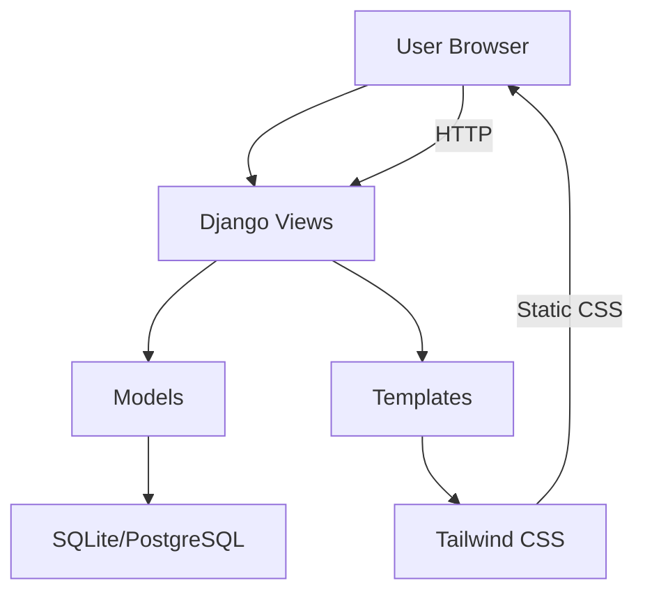

# Event Management System - Project Plan

## Project Overview
A comprehensive Django-based Event Management System with Tailwind CSS frontend, featuring full CRUD operations, optimized database queries, search functionality, and deployment readiness for Render.

---

## Project Structure

```
assignment-01/
├── event_project/           # Main Django project
│   ├── __init__.py
│   ├── settings.py          # Configured for deployment
│   ├── urls.py              # Main URL routing
│   ├── asgi.py
│   └── wsgi.py
├── events/                  # Django app for events
│   ├── __init__.py
│   ├── admin.py
│   ├── apps.py
│   ├── models.py            # Category, Event, Participant
│   ├── views.py             # CRUD + Dashboard + Search
│   ├── forms.py             # Form validation
│   ├── urls.py              # App URL routing
│   ├── templatetags/
│   │   └── custom_tags.py
│   └── migrations/
├── templates/               # Base and shared templates
│   ├── base.html            # Base template with Tailwind
│   ├── navbar.html          # Navigation component
│   └── messages.html        # Flash messages
├── static/                  # Static files
│   ├── css/
│   │   └── output.css       # Compiled Tailwind CSS
│   └── src/
│       └── input.css        # Tailwind source
├── requirements.txt         # Dependencies
├── manage.py
├── package.json             # Tailwind configuration
├── tailwind.config.js
└── Procfile                 # For Render deployment
```

---

## Data Models

### Category
| Field | Type | Description |
|-------|------|-------------|
| name | CharField(100) | Category name |
| description | TextField | Category description |

### Event
| Field | Type | Description |
|-------|------|-------------|
| name | CharField(200) | Event name |
| description | TextField | Event description |
| date | DateField | Event date |
| time | TimeField | Event time |
| location | CharField(200) | Event location |
| category | ForeignKey | Link to Category |
| participants | ManyToManyField | Link to Participant |

### Participant
| Field | Type | Description |
|-------|------|-------------|
| name | CharField(100) | Participant name |
| email | EmailField | Participant email |
| events | ManyToManyField | Link to Event |

---

## Views & CRUD Operations

### Category Views
- `category_list` - List all categories
- `category_create` - Add new category
- `category_update` - Edit category
- `category_delete` - Remove category

### Event Views
- `event_list` - List events with category and participant count
- `event_detail` - Show event with all participants
- `event_create` - Add new event
- `event_update` - Edit event
- `event_delete` - Remove event

### Participant Views
- `participant_list` - List all participants
- `participant_create` - Add new participant
- `participant_update` - Edit participant
- `participant_delete` - Remove participant

### Dashboard Views
- `dashboard` - Organizer dashboard with stats

---

## Optimized Queries Implementation

### select_related (for category)
```python
Event.objects.select_related('category').all()
```

### prefetch_related (for participants)
```python
Event.objects.prefetch_related('participants').all()
```

### Aggregate Query
```python
from django.db.models import Count
total = Participant.objects.count()
```

### Filter Queries
- By category: `Event.objects.filter(category=category_id)`
- By date range: `Event.objects.filter(date__range=[start_date, end_date])`

---

## UI/UX Design (Tailwind CSS)

### Color Scheme
- Primary: Indigo-600 (#4F46E5)
- Secondary: Slate-800 (#1E293B)
- Background: Gray-50 (#F9FAFB)
- Card Background: White
- Accent: Emerald-500 (#10B981)

### Responsive Breakpoints
- Mobile: < 640px (sm)
- Tablet: 640px - 1024px (md/lg)
- Desktop: > 1024px (xl/2xl)

### Key Pages

#### Event Listing Page
- Search bar at top
- Filter dropdown for categories
- Date range filter
- Event cards showing: name, date, location, category badge, participant count
- Pagination if needed

#### Event Detail Page
- Full event information
- List of registered participants
- Add/remove participant functionality

#### Forms
- Modern input fields with floating labels
- Validation error messages
- Submit buttons with loading states

#### Organizer Dashboard
- 4-stat grid: Total Participants, Total Events, Past Events, Upcoming Events
- Today's Events section
- Clickable stats that filter displayed data

---

## Search Implementation

```python
# URL: ?q=search_term
search_query = request.GET.get('q')
events = Event.objects.filter(
    Q(name__icontains=search_query) | 
    Q(location__icontains=search_query)
)
```

---

## Deployment Configuration

### settings.py Requirements
```python
DEBUG = os.environ.get('DEBUG', 'True') == 'True'
ALLOWED_HOSTS = ['.onrender.com', '127.0.0.1', 'localhost']

if not DEBUG:
    SECRET_KEY = os.environ.get('SECRET_KEY')
    # Security settings for production
```

### Procfile for Render
```
web: gunicorn event_project.wsgi --log-file -
```

---

## Mermaid: Project Architecture



---

## Implementation Order

1. Create Django project and configure settings
2. Set up Tailwind CSS
3. Create and migrate models
4. Build CRUD views and forms
5. Implement optimized queries
6. Create base templates with Tailwind
7. Build event listing page
8. Build event detail page
9. Build forms with validation
10. Implement dashboard
11. Add search functionality
12. Configure deployment settings
13. Test all features
